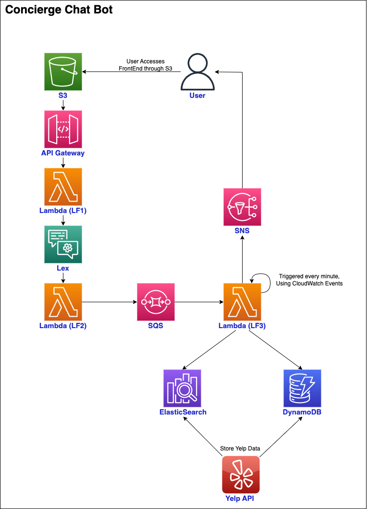

# Concierge Chat Bot

*Serverless microservices-driven AI Chatbot that provides restaurant suggestions in New York City, based on user preferences*

### Description
* The user interacts with Amazon Lex through a web application hosted on S3
* Lex bot collects information like location, time, cuisine, and contact details
* LF2 (Lambda) validates the information and pushed the request onto SQS
* Populate restaurants into a DynamoDB table and an ElasticSearch index, using Yelp API
* LF3 queries the ES index and fetches restaurant info from the database to generate suggestions

### Architecture

### Tech stack

AWS (S3, API Gateway, Lambda, Lex, SQS, SNS, DynamoDB, CloudWatch), ElasticSearch, Python, Yelp API

### Contributors
* Vishal Prakash (vp2181@nyu.edu)
* Vedang Mondreti (vm2129@nyu.edu)
